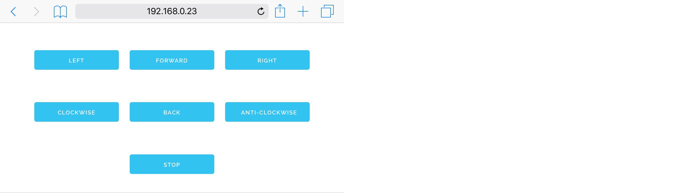

# STS-Pi controller

A super simple web app controller for the Pimoroni STS-Pi robot, using Flask and Skeleton.



## Pre-requisities

You'll need Flask:

```
sudo pip install Flask
```

You'll also need the Pimoroni Explorer HAT library:

```
curl get.pimoroni.com/explorerhat | bash
```

And then you should reboot.

## Installing and using the controller

Just clone this repo or download the zipped version:

```
git clone https://github.com/sandyjmacdonald/sts_pi_controller.git
```

Then, move into the `sts_pi_controller` directory and run the app:

```
cd sts_pi_controller
sudo python app.py
```

The app will now be running on port 80 at the IP address of your Pi. Just
enter that address in your browser and away you go!
